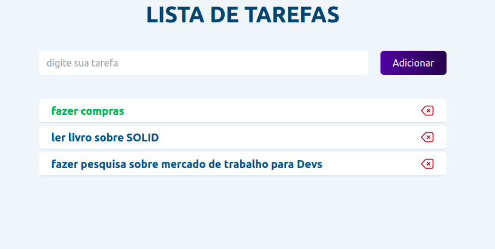

# TO-DO-LIST
### Projeto de estudo em react e tailwindCSS

### Descrição
esse app foi criado a fins de estudo do react, trata-se de uma lista de tarefas básica, com persitências dos dados no localStorage, podem excluir a tarefa e marcar como concluída.

### Contexto de negócio
```
React
TailwindCSS
```

### requisitos
```
Node v20.11.0
```
para verificar sua verão do node, digite "node -v" no seu terminal. se estiver com uma versão muito atrás, vc pode usar o NVM para instalar outra versão do node. https://github.com/nvm-sh/nvm#installation-and-update

### print da tela


## Executar localmente
```
# git clone
# npm install
# npm run dev
```


#### endereços para acesso:
```
Endereço do app: http://localhost:3000
```

Developed by Neilton Rodrigues